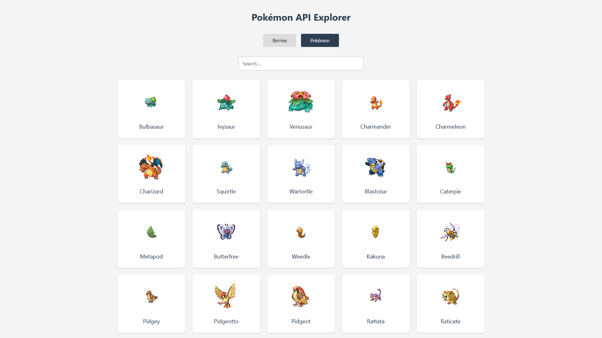

# Pokémon API Explorer



## Description

Pokémon API Explorer is an interactive website that allows users to explore Pokémon and Berries data from [PokeAPI](https://pokeapi.co/). This website features a modern and minimalist design, equipped with various interesting features.

## Main Features

- **Dual API Explorer**: Explore Pokémon and Berries data in one application
- **Responsive Design**: Optimized design for various screen sizes
- **Loading Animation**: Engaging Pokéball animation while waiting for data to load
- **Detailed Information**: Comprehensive details for each item (Pokémon/Berries)
- **Search Feature**: Quickly search items by name
- **Grid View**: Display data in a neat grid layout
- **Hover Effect**: Visual effect when hovering over items
- **Detail Modal**: Pop-up display for detailed information

## Technologies Used

- **HTML5**: Basic website structure
- **CSS3**: Styling and animations
- **JavaScript**: Interactivity and API data fetching
- **PokeAPI**: Source of Pokémon and Berries data

## How to Use

1. Select "Berries" or "Pokémon" menu at the top of the page
2. Use the search field to find specific items
3. Click on an item to view detailed information
4. Use the close button (X) or click outside the modal to close the detail view

## Installation

1. Clone this repository:
   ```bash
   git clone https://github.com/Prominents/APIfetch.git
   ```
2. Open the project folder:
   ```bash
   cd APIfetch
   ```
3. Open the `index.html` file in your browser

## Contribution

Contributions are always welcome! Please open an issue or pull request if you want to contribute to this project.

## License

This project is open-source and available under the MIT License.